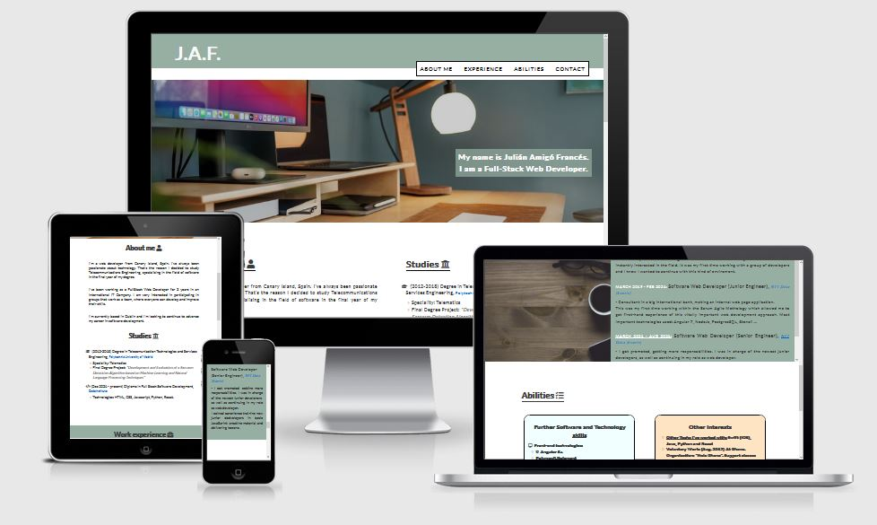

# MY_CV-HTML_AND_CSS

This website is designed to show my basic HTML and CSS skills by making an usefull and user-friendly website, where further information about my career is shown.

Users will be able to navigate through the differents section and find out relevant information about me, my studies, work experiences, and so on.

In addition, users will be able to get in touch with me by filling out a form located in the "Contact me" section.  

## User Stories
- As an user... I want... so that...

- As a developer I want to have the first tutoring session so that I can show my mock-up and I can start with the P1
- As a developer I want to write out in the README file and finish it, all the points so that, anybody can access to it and understand better what is the project about 

- make the basic structure of the three HTML files. 
- index.html: make and style the Header and the Navigation bar.
- index.html: make and style "About me" Section.
- index.html: make and style "Experience" Section.
- index.html: make and style "Abilities" Section.
- index.html: make and style the Footer.
- contact.html: make and style the "Form" Section.
- confirmation.html: make and style the "Confirmation" Section.
- Second tutoring session.
- Do the code testing.
- Fix found bugs.
- Complete the remaining items of the Readme file.
- Third and last tutoring session.

## Features

## Future features

## Typography and color scheme

## Wireframes

## Testing
### Code validation
### Test cases 
### Fixed bugs
### Supported screens and browsers

## Deployment
(explain how deploy the projecy and how to run it locally)
### Via gitpod
### Via github pages

## Credits
### Content
### Media