# MY_CV-HTML_AND_CSS

This website is designed to show my basic HTML and CSS skills by making an usefull and user-friendly website, where further information about my career is shown.

Users will be able to navigate through the different sections and find out relevant information about me, my studies, work experiences, and so on.

In addition, users will be able to get in touch with me by filling out a form located in the "Contact me" section.  

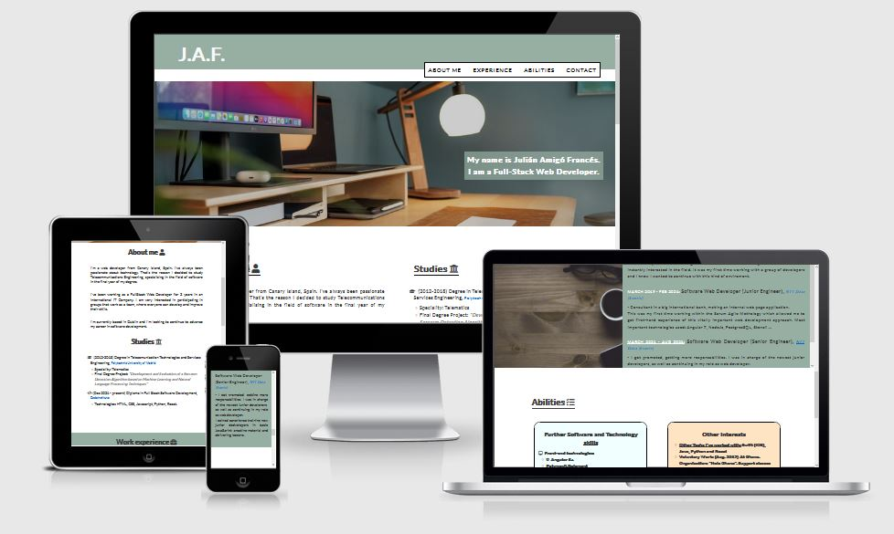

# Table of Contents

- [User Stories](#user-stories)
- [Features](#features)
- [Future features](#future-features)
- [Typography and color scheme](#typography-and-color-scheme)
- [Wireframes](#wireframes)
- [Technologies](#technologies)
- [Testing](#testing)
- [Deployment](#deployment)
- [Credits](#credits)

## User Stories
1) As an user I want to see the header and the navigation bar on the top of the website, so that I'll be able to navigate throught the different pages.
2) As an user I want to see the "About me section" so that I'll be able to see the main information about me in the online CV.
3) As an user I want to see the "Experience" section so that I'll be able to see the work experience in the CV.
4) As an user I want to see the "Abilities" section so that I'll be able to see the work abilities in the CV index.
5) As an user I want to see the footer with the contact of the person so that I'll be able to get in touch with him.
6) As an user I want to see a the "Contact" section in a new page (with the same header and footer) so that I'll be able to contact with him.
7) As an user I want to see a confirmation page when I submit the contact form, so that I'll know that it's been submitted correctly.

## Features

- __Navigation Bar__

    - Featured at the top of the page, on all three pages: the main page, the contact form page and the confirmation page. 
    - In the left corner of the navigation bar the 'Julián Amigó Francés' logo (J.A.F.) is showed, that links to the top of the main page.
    - In the right of the navigation bar, the other navigation links are displayed: 'About me', 'Experience', 'Abilities' and 'Contact'. The first three move to the relevant sections of the same page, while the last one links to the contact form located on a new page.
    - The color of this section is a soft green, used throughout the page, as we will see bellow.

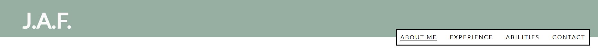

- __The Header__
    
    - As a background is used a set-up image, where the colours are similiar to the soft green we've already used.
    - The header section shows my full name and my profession. It is located at the bottom left of this section. 
    - The background color of this text is the same soft green as was mentioned for the header.

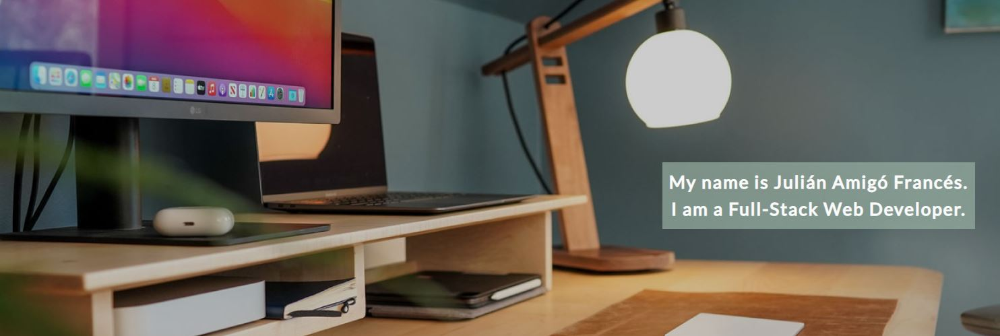

- __About me section__

    - The About me section is divided in two subcolumns: 'about me' and 'studies'. It is displayed in a white background. 
    - In the first 'About me' column a brief introduction about me is shown, giving the most relevant details about my career, experiences and life.
    - Besides that, the 'studies' column shows the user my university degree and other important certificates or courses I've completed or are still in proccess of completing.

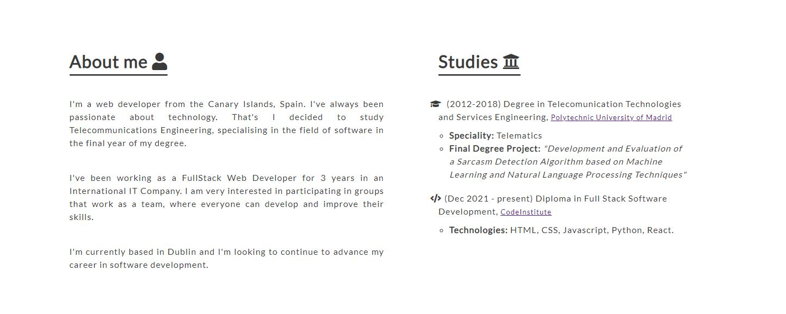

- __Work experience__

   - This section shows more deeply detailed information about my work experience. For each work experience mentioned, the years worked on it, the company and the relevant aspects of job position are indicated.
   - It is divided in two columns. The first columns is only for the title of the section, displayed with a background image.
   - The second column is displayed on a green background and all the information mentioned above is shown.

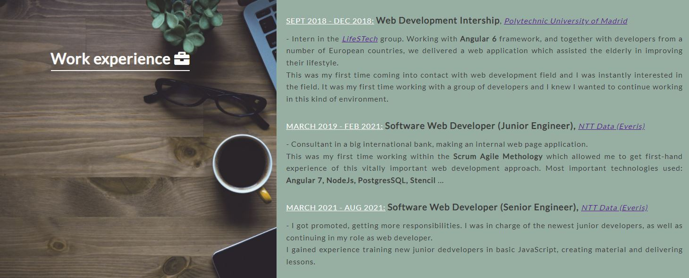

- __Abilities__

    - This Abilities section, displayed on a white background, collects three differents subsections, each covered by a box.
    - The first box gives "Further software and Technology skills" that I've worked with.
    - The second box, shown on a soft orange background, gives "Other interests" information, such as other technologies that can be mentioned or voluntary work I've done.
    - In the last box, displayed on a soft green background, the spoken languages I feel comfortable with are mentioned.

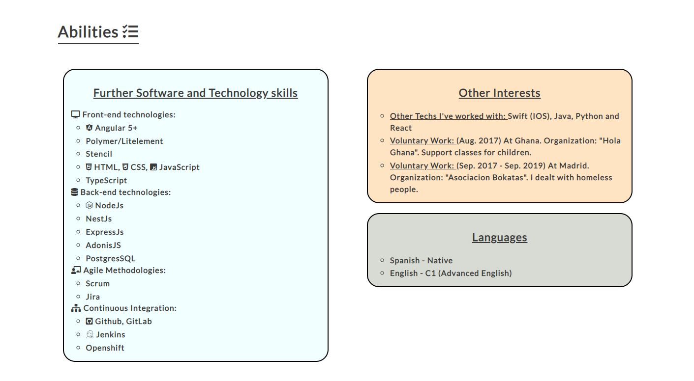

- __Contact__

    - This contact section is located in another page. By clicking on the contact link that is the last link in the navigation bar, you can navigate to this page.
    - In here, the user can get in touch with me, by filling in the form with all the required inputs.
    - There is just one section in this page, and the form is on a background image. Three inputs are mandatory in order to submit and get in touch with me: Full name, email and message.

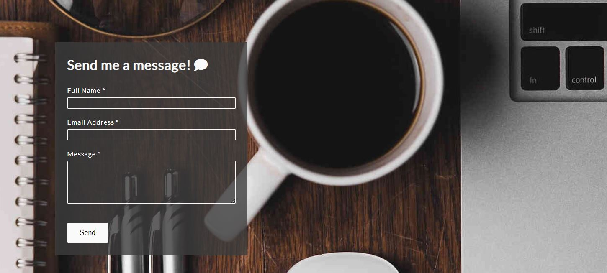

- __Confirmation section__

    - Once you have clicked on the submit button, you will be redirected to another page, where a confirmation message will be shown in order to let you know that the form has been successfully sent.

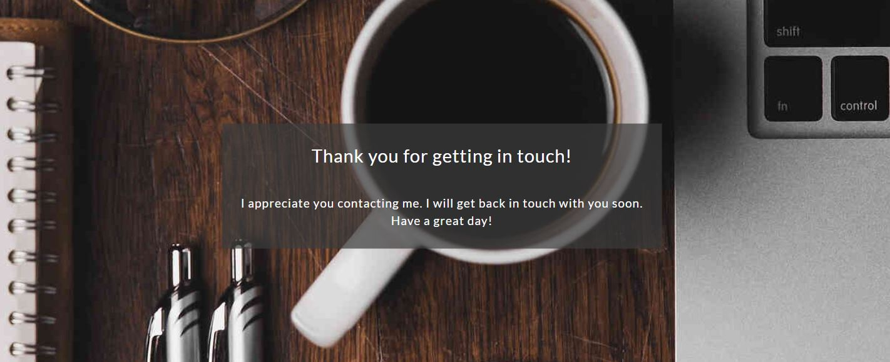

- __Footer__

    - This footer section is displayed on a soft green background.
    - It is divided in two columns, where different ways of get in touch with me are given.
    - In the first column three link icons are positioned in the left side, and will redirect to each social media ny clicking on them. 
    - In the second colum my contact information is given, such as my email and phone number.

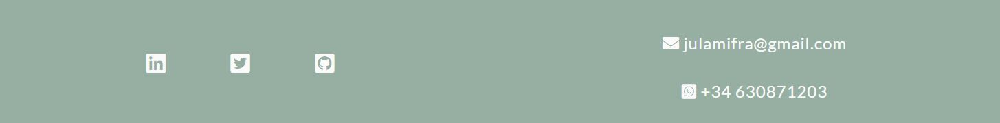

## Future features

- One posible future future might be to give real functionaly to the get-in-touch form by setting up a javascript functionality in it.
- Another usefull functionality might be to change the navigation bar in mobile design, creating a drop-down menu, for example.

## Typography and color scheme

- __Typography__

    - "Source Sans Pro" from [Google Fonts] has been chosen as the main font for the entire website.
    - This font has been tested for all screen sizes and fit well to each of them. 
    - It gives a profesional and modern look to the webpage, which is what an online CV needs.

- __Color Scheme__

    - In order to pick the accurate color that better fit with the website, I've used [Color Adobe](https://color.adobe.com). Here I could generate a color palette and get all the necessary Hexadecimal Colors. 
    - I wanted to give my website a calming feel and profesionality, by selecting soft, muted colours and choosing images related to office enviroment.
    - Therefore, the soft green, which is used in most of the above-mentioned section, is the main colour chosen for the website, which is displayed throughout. 

## Wireframes

- [Balsamiq Wireframes](https://balsamiq.com/) has been the tool used to generate the digital sketches of the initial website idea. 
- Below the sketch of the inital idea is shown. Some detail has been modified as the project progressed, such as the header image or the distribution of some content, in order to fit the text to the distribution of the elements.

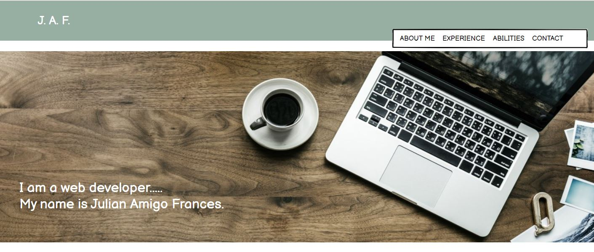
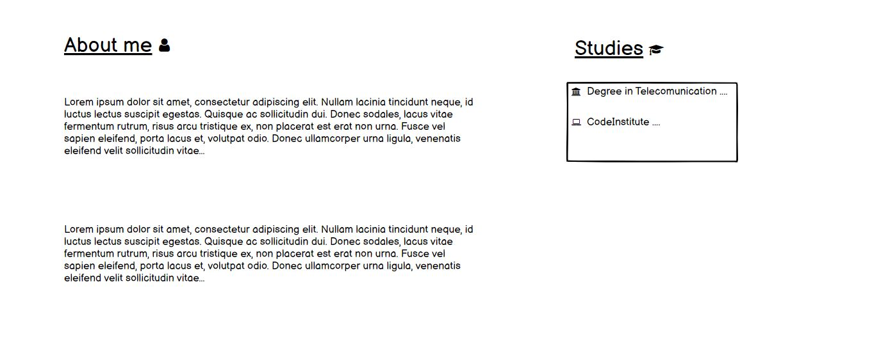
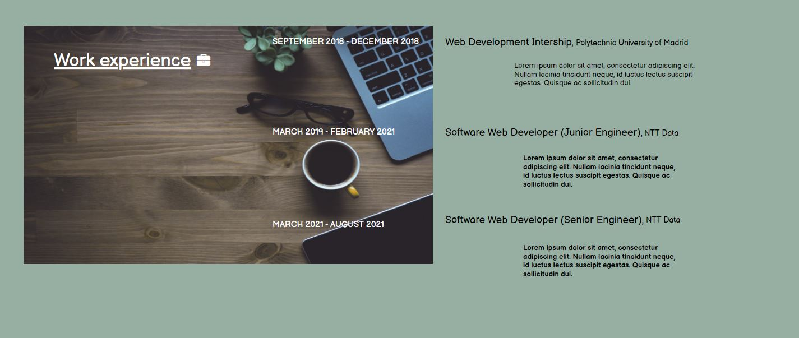
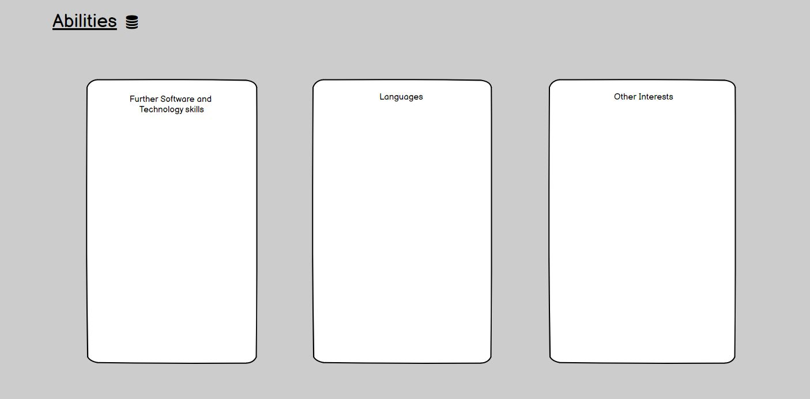
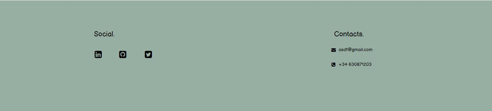
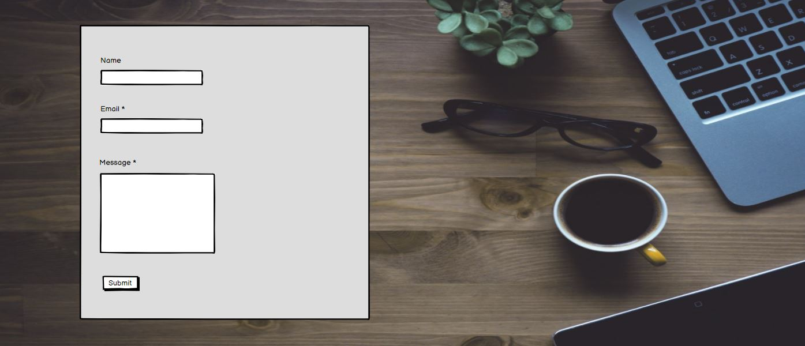

## Technologies

- HTML and CSS: 
    - **HTML** is the standard markup language for Web pages.
    - **CSS** is the language we use to style and HTML document.
    - Both programing languages are the main technologies used in this project in order to create the webpage. 
- GitHub Pages: it is a static site hosting service. It take the code from a Github reposiroty and publishes a website. It will be explained in further detail in the [Deployment](#Deployment) section.
- GitPod: this tool has been chosen as the IDE of this project. It is a cloud development environment accessible via a browser, that can be run directly from the github repository.

## Testing

### Test cases and fixed bugs

- Tests have been done to each user story as well and in here, only few bugs have been found. These bugs are the following:
    - User story number 1: Half of the navigation bar was behind the main header image. To fix this, a z-index attribute has been set on the "<nav>" tag in the css.

    - User story number 3: some of the element widths were bad styled on mobile design. To fixed it, the element width has been calculated with the function "calc()".

    - User story number 5: two of the links within the footer section, on the confirmation page, redirected to a 404-not-found page. This bug has been fixed by setting the correct URL for those <a> elements that redirected to the wrong page.
    
    - User story number 6: on the contact form another bug was found related to the initial textarea value. It was a blank space, so the form could be submitted with an imput "message" input. To fix it, some blank spaces have been removed from the HTML within contact.html file.
    
### Code validation

- __HTML:__ Some errors ocurred after auditing every page with the official HTML validator: [HTML Validator](https://validator.w3.org/).
    - Errors found on the index.html:
    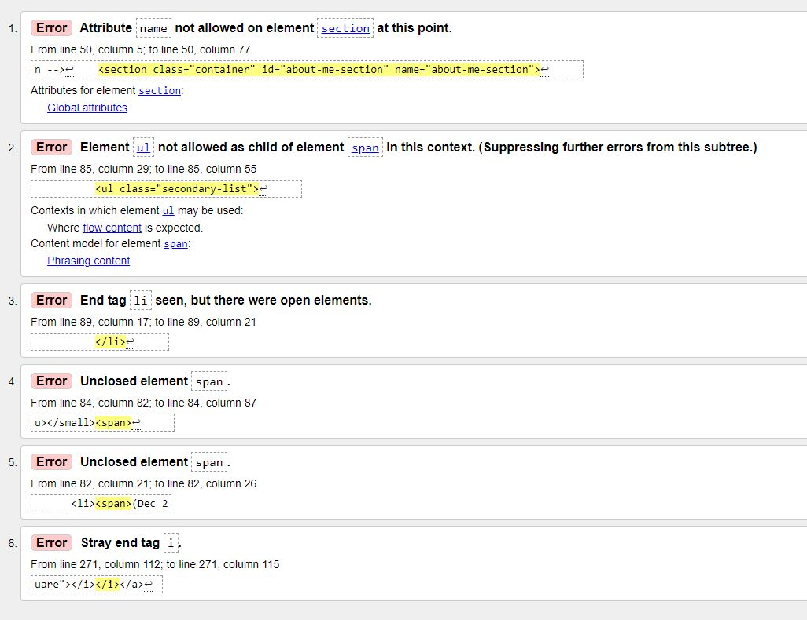
    - Errors found on the contact.html:
    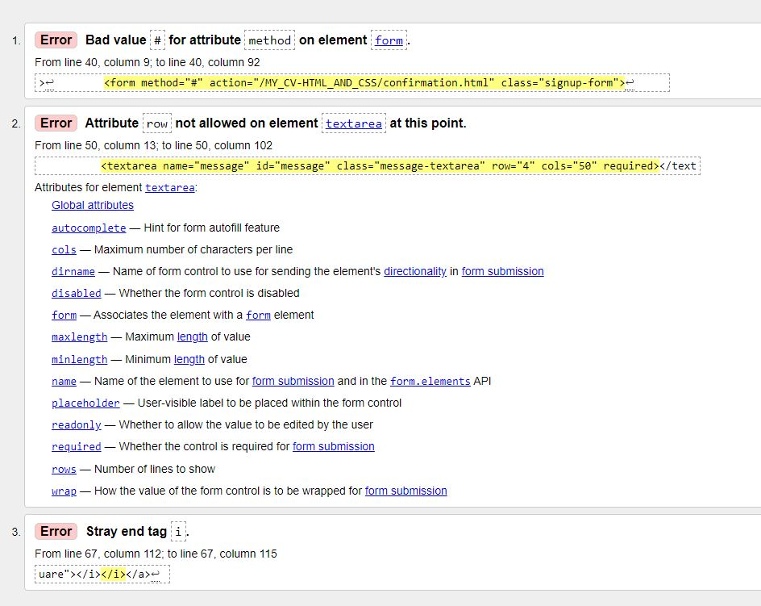
    - Errors found on the confirmation.html:
    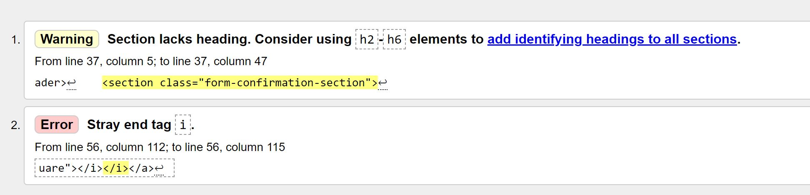

All these bugs have been detected and fixed after the HTML validator testing, as were undetectable while testing the user stories. 

- __CSS:__ No errors ocurred after auditing the style sheet with the CSS validator: [CSS Validator](https://www.cssportal.com/css-validator/).

### Lighthouse - Dev Tools

- I have used Lighthouse from Google Chrome DevTools, to test my website performance and accesibility. The first testing scored 84%, as some audit failed. 
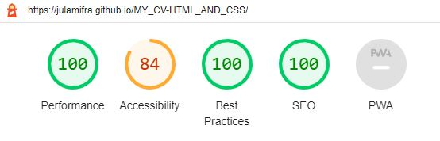

- Color contrast was one of them, and to improve this failure, some white texts (with a green background) have been modified to black. [Color Contrast recommendations](https://web.dev/color-contrast/?utm_source=lighthouse&utm_medium=devtools)
- In addition, it was also recommended to add a discernible name to the footer links. [Links recommendations](https://web.dev/link-name/?utm_source=lighthouse&utm_medium=devtools)

- Therefore, by fixing this found bugs the new lighthouse score is as follows:
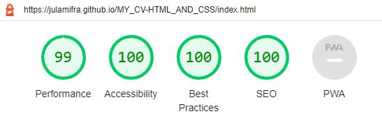

### Supported screens and browsers

- The website was tested on the most common screen sizes. The sizes where possible erros could appeared were: 1200px, 900px and for mobile sizes (down 480px). For this reason, three different styles have been set for these three cases.

- The browsers where the website has been tested are Firefox and Google Chrome. In the case of the former, the tests have only carried out for desktop size. For the latter, tests for mobile and desktop sizes have been done. 

## Deployment

The website was deployed to GitHub pages. These are the steps to deploy it:
- Navigating to the GitHub repository settings tab, you will find the "Pages" tab.
- In this tab, choosing the main branch of the site and saving the changes it is enough to deploy.
- Once it has deployed (it could take 5-10 minutes) the site would be available on the URL shown in this "pages" tab. 
- The deployed URL for this project is the following: [Deployed URL](https://julamifra.github.io/MY_CV-HTML_AND_CSS/).

## Credits

I like to thank my tutor, Rohit, for all the recommendations he has given me. 

### Content

### Media